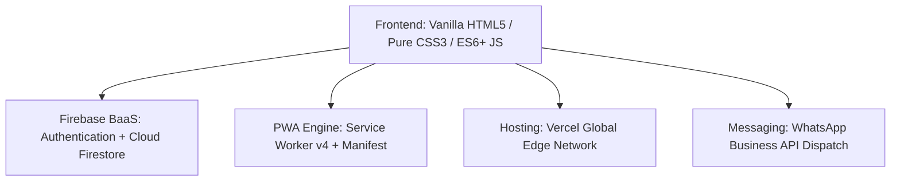

# 👑 Royal Perfume Store — Luxury E-Commerce Web Application

<div align="center">


[](https://perfume-store-azure-nine.vercel.app)
[](https://perfume-store-azure-nine.vercel.app/admin.html)
[](https://opensource.org/licenses/MIT)

<br/>

> **An ultra-luxurious, production-ready fragrance boutique web application** built with pure Vanilla JavaScript (ES6+), Vanilla CSS, Firebase Cloud Firestore (Real-Time BaaS), WhatsApp Order Integration, and Progressive Web App (PWA) offline capabilities.

<br/>

### 🌐 [Click Here to View Live Store on Vercel](https://perfume-store-azure-nine.vercel.app) | 🛡️ [Admin Control Panel](https://perfume-store-azure-nine.vercel.app/admin.html)

---

### 🎬 [Watch Full Walkthrough Video Demo](https://github.com/kerolesboles26/Perfume-store/releases/download/v1.0.0/Video.Project.1.mp4)

</div>

---

## 🌟 Key Engineering & Business Features

### 1. 💎 Luxury Visual Identity & UI/UX
* **Curated Royal Theme**: Gold accents (`#c9a227`), deep obsidian glassmorphism backgrounds (`#0d0e12`), and Google Fonts typography (Cinzel & Outfit / Cairo).
* **Dark / Light Mode Toggle 🌙☀️**: Instant theme switcher persisted across user sessions via `localStorage` with silky smooth CSS transitions.
* **Bilingual Engine (Arabic & English 🌐)**: Complete RTL (Right-to-Left) and LTR bidirectional switching across all 15+ pages with zero page-reload lag.
* **Progressive Web App (PWA 📱)**: Full installability on iOS, Android, macOS, and Windows via `manifest.json` and `sw.js` Service Worker with offline asset caching.

### 2. 🛍️ Browsing, Olfactory Filtering & Discovery
* **Dynamic Scent Family Filtering**: Filter by scent family (*Fresh, Woody, Floral, Oriental / Oud, Aquatic, Fruity*), target gender (*Men, Women, Unisex*), and price ranges.
* **Live Search & Multi-criteria Sorting**: Search by ingredients, olfactory notes, or fragrance name; sort by popularity, customer ratings, and price.
* **Skeleton Shimmer Loaders**: Golden skeleton loaders preventing any layout shift or perceived loading delays.
* **Social Sharing**: One-click fragrance sharing directly to WhatsApp, LinkedIn, or instant clipboard copy.

### 3. 💳 Cart, Checkout & WhatsApp Order Confirmation
* **Real-time Synchronized Cart & Wishlist**: Cloud-synced state between client browser cache and Firebase Cloud Firestore.
* **Interactive Promo System**: Dynamic discount codes with instant total deductions (`LUXURY10`, `ROYAL20`).
* **WhatsApp Order Notification 💬**: Instant dispatch of itemized order summaries directly to the store manager's WhatsApp (`01208077173`).
* **Official Printable Receipt**: Auto-generated luxury printable invoice with royal stamp and tax/discount breakdown (`printOrderInvoice`).

### 4. 📦 Real-Time Order Tracking & Admin Control Panel
* **Live 4-Stage Stepper Tracking**: Real-time visual progress tracker:
  `Order Received 📝 ➔ Luxury Packing 🎁 ➔ Out for Delivery 🚚 ➔ Delivered ✨`
* **Real-Time Admin Dashboard (`admin.html`)**:
  * Live revenue counters, active orders count, and unique customer statistics.
  * Real-time search by customer name, phone number, or order ID.
  * Instant status update dropdown (changes reflect on customer tracker in real time).
  * Direct WhatsApp customer contact button & permanent deletion controls.

---

## 🛠️ Technology Stack



| Component | Technology / Service | Details |
|---|---|---|
| **Architecture** | Jamstack / Vanilla ES6+ | No bloated frameworks; ultra-lightweight, 60fps animations |
| **Styling** | Pure Vanilla CSS | Custom design tokens, glassmorphism, responsive Grid & Flexbox |
| **Database & Auth** | Firebase Cloud Firestore | Real-time `onSnapshot` listeners, Google OAuth & Email/Password Auth |
| **Offline & PWA** | Service Worker (`sw.js`) | Offline cache-first strategy for zero-latency asset loads |
| **Hosting & CI/CD** | Vercel Edge Network | Instant CDN delivery with automatic GitHub branch deployments |
| **Integration** | WhatsApp Web API | Automated structured message payload generation |

---

## 📂 Project Architecture

```text
Perfume-store/
├── index.html              # Luxury Landing & Showcase Page
├── products.html           # Catalog with Multi-Facet Filtering
├── product-details.html    # Detailed Perfume View & Fragrance Notes
├── cart.html               # Shopping Cart & Quantity Manager
├── checkout.html           # Checkout Flow & Promo Codes
├── order-history.html      # Real-Time Order Management & Stepper Tracker
├── order-success.html      # Post-Checkout Confirmation & Invoice
├── profile.html            # User Account, Password & Profile Management
├── wishlist.html           # Saved Favorites Collection
├── admin.html              # Store Management & Real-Time Analytics
├── about.html              # Brand Story & Craftsmanship
├── contact.html            # Customer Inquiries & Store Location
├── app.js                  # Core Store Engine & UI State Management
├── firebase-auth.js        # Firestore Sync, Auth & Real-Time Listeners
├── admin.js                # Admin Dashboard Real-Time Logic & Metrics
├── style.css               # Comprehensive Luxury CSS Design System
├── admin.css               # Admin Control Panel Styling
├── sw.js                   # Service Worker (PWA Offline Cache v4)
├── manifest.json           # Progressive Web App Configuration
├── vercel.json             # Vercel Production Static Edge Config
└── local_server/           # Local Development Server
    └── server.js
```

---

## ⚡ Quick Local Development Setup

### 1. Clone the repository
```bash
git clone https://github.com/kerolesboles26/Perfume-store.git
cd Perfume-store
```

### 2. Run Local Server
* **On Windows**: Double-click `start.bat`
* **Via Terminal**:
```bash
node local_server/server.js
```
Then navigate to `http://localhost:5000` in your browser.

---

## 👨‍💻 Author & Developer

* **Keroles Boles**
* **GitHub**: [@kerolesboles26](https://github.com/kerolesboles26)
* **Project Repository**: [Perfume-store](https://github.com/kerolesboles26/Perfume-store)
* **Live Deployment**: [perfume-store-azure-nine.vercel.app](https://perfume-store-azure-nine.vercel.app)

---

## 📄 License
This project is licensed under the [MIT License](LICENSE) — free to use and adapt for academic, personal, and commercial purposes